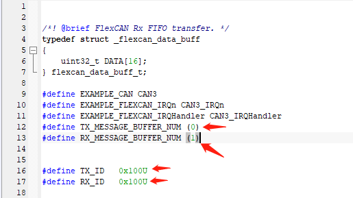
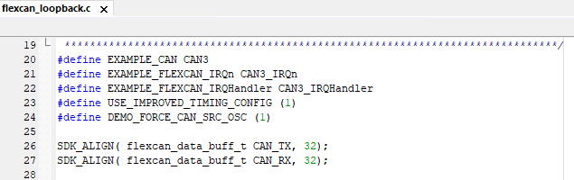
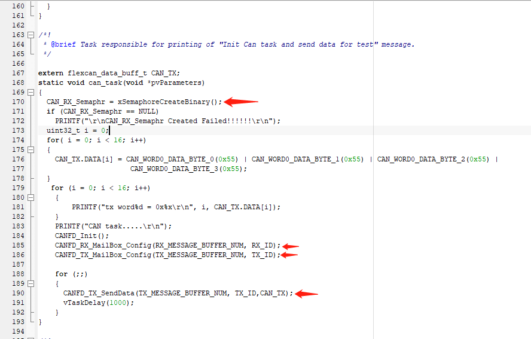
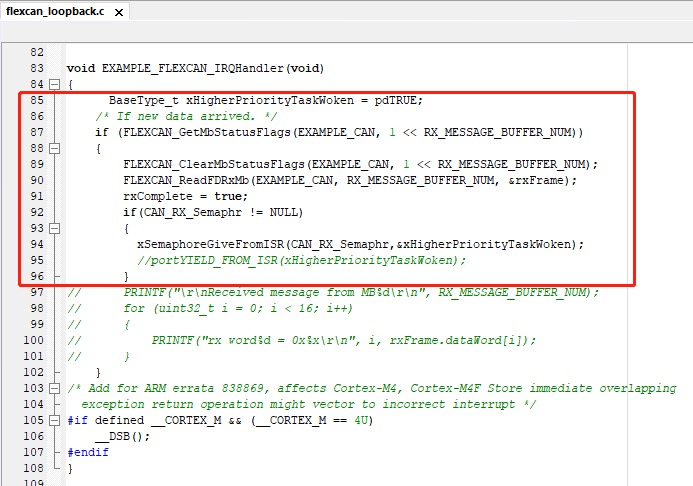
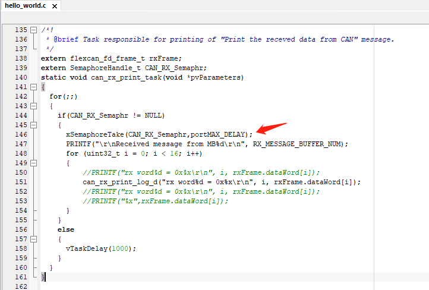

# How to create a new CAN-FD mailbox

1. Define a MB index number in flexccan_loopback.h

   a. Usually we can use the same TX MB for TX, but user still can define a new index number by themselves. For RX, user’s can define it by themselves for each task

   b. Define the message ID for the message. User’s need’s to make sure that the ID number for TX and RX are same ID.

2. User needs to define a TX or RX buffer like Line26 and 27 to make sure the buffer address is aligned with cache line

3. User needs to init the MB with their new Main box index number and Message ID in the CAN task:

   a)   Init a semaphore for get a signal form interrupt. Line 170

   b)   Prepare the TX data like Line 176

   c)   Configure your new TX and RX mailbox like Line 185 and 186

   d)   User can send the data like Line 190

   

4. Once the TX data sent, will generated a RX MB interrupt . User can use the following picture to get the data and give the Semaphore signal to the data process task.

   

   

   5. Then the task which can take the Semaphore signal will start the processing task.
   6. 