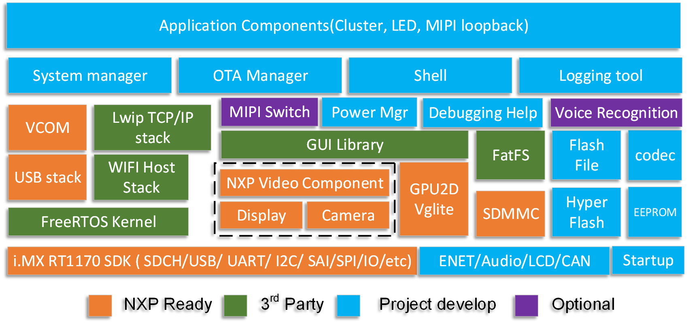
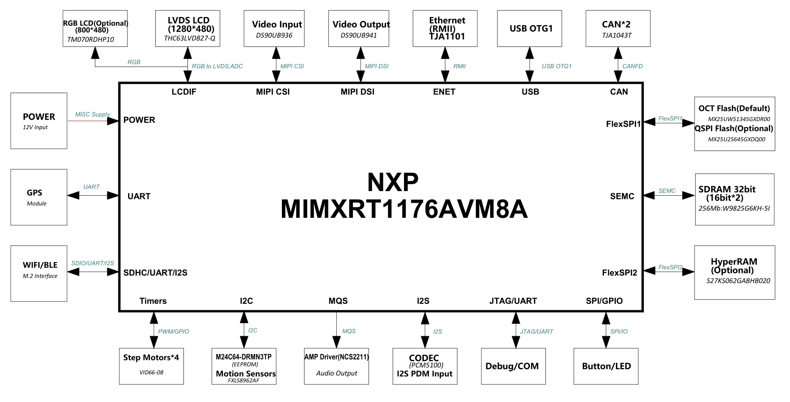

# Introduction
The main function of automotive cluster is to provide key driving parameters to the driver and at the same time to help the maintainer for trouble shooting. It is composed of various instruments, indicator, especially the alarm and warning light etc.

# Software Architecture

# Hardware Illustration

# How to setup the demo

